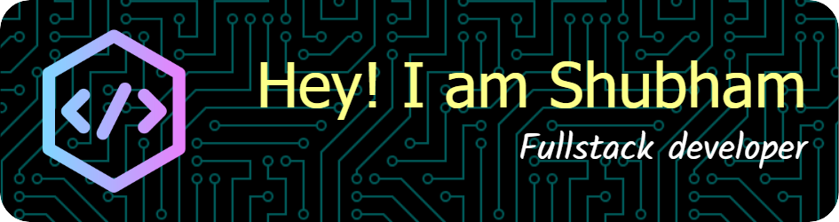

# Shubham Revankar

AI infrastructure and backend engineer at Oracle, working on distributed
cloud-operations platforms and production Agentic AI systems.

I build reliable systems around retrieval, tool execution, workflow
orchestration, evaluation and cloud infrastructure.

## Featured Work

### Secure Enterprise RAG Assistant
Permission-aware retrieval with database-enforced ACLs, hybrid search,
reranking, citation validation, evaluation and observability.

- 110-case deterministic evaluation suite
- 95.1% Recall@5
- 0% RBAC leakage
- Docker, CI, Prometheus and Grafana

[Repository](https://github.com/shubhamrevankar/SecureRAG) | [Demo](https://youtu.be/j3Dn1Y7hyXE)

### TaskForge
Durable workflow orchestration using Java, Spring Boot, PostgreSQL and
Redis Streams.

- Transactional outbox
- At-least-once execution
- Leases and fencing tokens
- Retries, dead-letter replay and crash recovery
- Validated DAG workflows

[Repository](https://github.com/shubhamrevankar/TaskForge-Workflow-Orchestrator) | [Demo](https://youtu.be/FTRpo9q7h18)

## Current Focus

- AI agent infrastructure
- Secure retrieval and evaluation
- Durable distributed workflows
- Open-source contributions to early-stage AI infrastructure companies

## Contact

[LinkedIn](https://www.linkedin.com/in/shubhamrevankar/) | shubhamsrevankar8668@gmail.com
